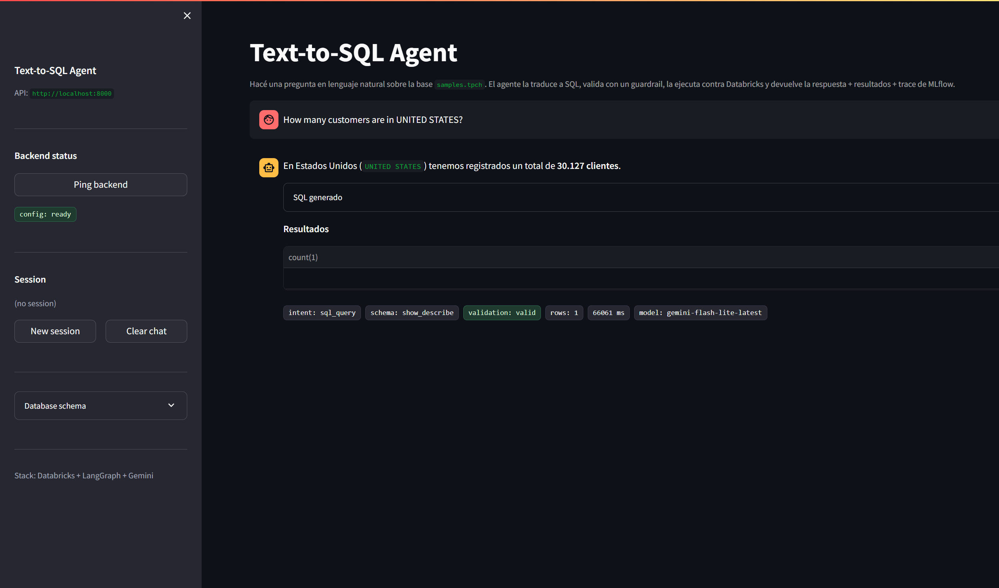
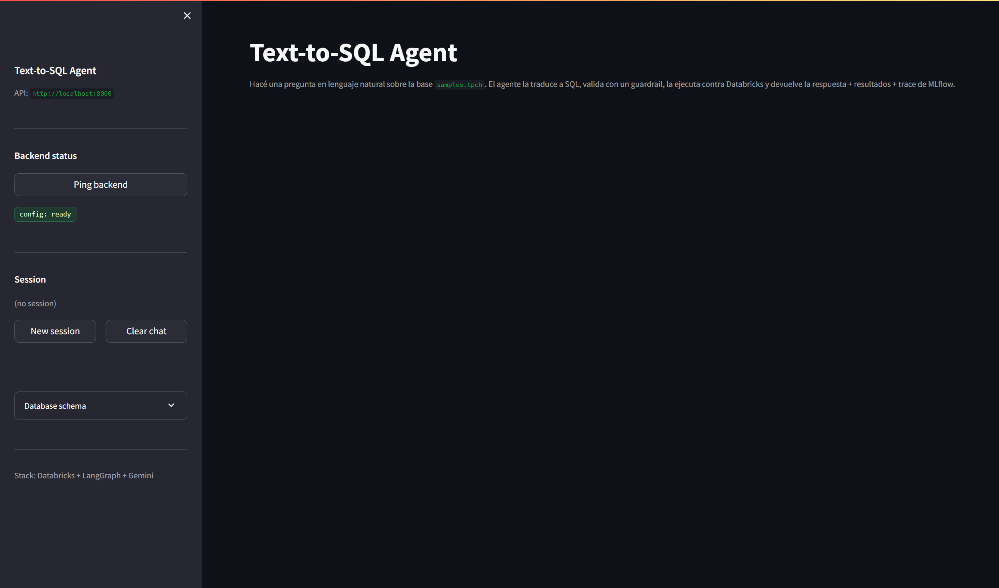
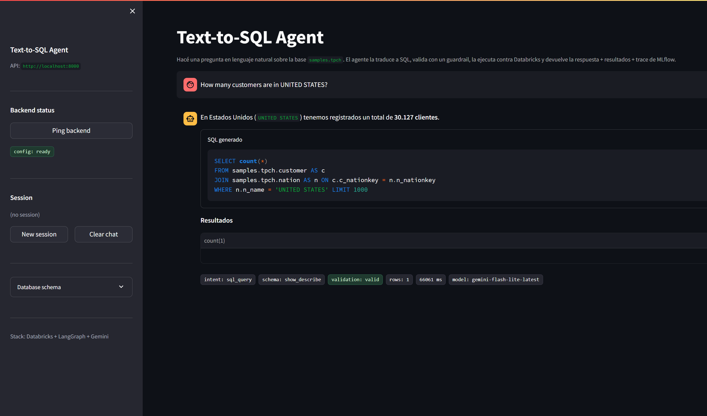
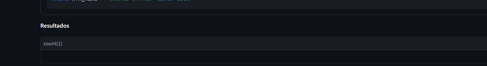
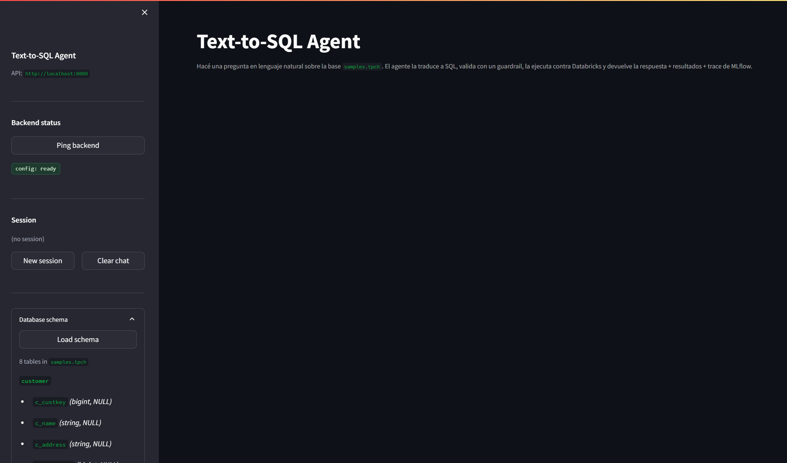

# Text-to-SQL Agent

> Agente AI que traduce preguntas de negocio en lenguaje natural a SQL, las ejecuta con guardrails, se auto-corrige cuando fallan, y mantiene memoria multi-turn. Construido con **LangGraph** + **Google Gemini** + **Databricks SQL**.


---

## TL;DR

- 30 preguntas de eval contra `samples.tpch` (TPC-H nativo de Databricks Free Edition)
- **100% (30/30)** execution accuracy con los 3 prompt fixes aplicados
- **100% execution success** (todas las queries que genera el agente ejecutan sin error)
- Latency p50: **25s**, p95: **76s** (con Gemini free tier, 25 RPM)
- 183 tests pytest pasando en ~3s (sin credenciales necesarias, todo mockeado)
- Costo de inferencia: **USD 0** (Gemini free tier + Databricks Free Edition)
- Version **1.0.0**
- Repo: [github.com/franco18min/text-to-sql-agent](https://github.com/franco18min/text-to-sql-agent) (codigo; no es una demo live)



Pregunta live (local, `samples.tpch`): *How many customers are in UNITED STATES?* Respuesta NL: **30.127 clientes**. Chips de esa corrida: `intent: sql_query`, `schema: show_describe`, `validation: valid`, `rows: 1`, `66061 ms`, `gemini-flash-lite-latest`.

<details>
<summary>Mas capturas del mismo flujo</summary>



Sidebar local: API `http://localhost:8000`, chip `config: ready` (Databricks configurado en `.env`). Esta captura es pre-query; no es un ping profundo `status: ok`.



Expander **SQL generado** abierto: `SELECT count(*)` sobre `samples.tpch.customer` JOIN `nation` con `n_name = 'UNITED STATES'` y `LIMIT 1000`.



Chips de metadata de la misma corrida (intent / schema source / validation / rows / latency / model). No son metricas del eval de 30 preguntas.



Expander **Database schema** tras `GET /schema`: 8 tables in `samples.tpch`, columnas `name`/`type` (ejemplo: `customer.c_custkey (bigint)`).

</details>

---

## El problema

Los analistas de datos pasan una fraccion significativa de su tiempo escribiendo SQL repetitivo: queries de revenue, top customers, cohortes, etc. Las preguntas de negocio son las mismas; el SQL cambia poco. Un agente NL2SQL deja al humano decidir **qué** quiere saber, y al modelo decidir **cómo** pedirlo.

Este proyecto ataca ese problema con un agente que:

1. Entiende la pregunta en lenguaje natural
2. Ve el schema real de la DB (no se lo tiene que memorizar)
3. Genera SQL que matchea el dialecto de Databricks (Spark SQL)
4. Lo valida contra un guardrail de operaciones read-only
5. Lo ejecuta y devuelve el resultado
6. Si falla, se auto-corrige con el feedback
7. Recuerda turnos anteriores en la misma sesión

---

## Resultados

**Eval set**: 30 preguntas categorizadas sobre `samples.tpch` (TPC-H benchmark: 8 tablas, ~6M lineitems, 25 naciones, 1.5M customers).

| Metrica | Valor | Notas |
|---|---|---|
| Questions | 30 | categorias: aggregate, filter, 2-table join, 3-table join, group_by, having, edge cases |
| **Execution success** | **100%** | ninguna query generada fallo en ejecucion |
| **Execution accuracy** | **100% (30/30)** | con los 3 prompt fixes aplicados (subio de un snapshot historico 83% → 93.3% → 100%) |
| Latency p50 | 25.7s | dominada por la latencia del LLM, no del SQL |
| Latency p95 | 76.0s | outliers son llamadas lentas a Gemini (rate limiting) |
| Retries avg | 0.00 | el agente resuelve en el primer intento la mayoria de las veces |

Por categoria:

| Categoria | n | acc% |
|---|---|---|
| single_table_aggregate | 4 | 100% |
| single_table_filter | 2 | 100% |
| two_table_join | 5 | 100% |
| three_table_join | 5 | 100% |
| group_by_order | 6 | 100% |
| having_subquery | 3 | 100% |
| edge_case | 5 | 100% |

Historia del eval (snapshot **historico**, no current): 83% (run inicial con bugs en GTs) → **93.3%** (GTs corregidos; fallas **historicas** Q16/Q28) → **100% (30/30)** current. Detalle completo en `data/eval/README.md` y `docs/eval-results.md`.

---

## Que demuestra este proyecto (para entrevistas)

| Capacidad | Como se ve aca |
|---|---|
| **Agentic AI** | State machine de LangGraph con ciclos de auto-correccion (si el SQL falla, vuelve al generador con el error) |
| **LLM engineering** | Prompts por nodo, retries exponenciales, degradacion graceful si la API falla |
| **Data engineering** | Schema retrieval sobre Databricks con `SHOW TABLES` + `DESCRIBE`, queries validadas antes de ejecutar |
| **Software engineering** | Tipos Pydantic, FastAPI con OpenAPI auto, 183 tests pytest con cobertura amplia, CI en GitHub Actions |
| **ML engineering** | Eval reproducible con ground truth, metricas por categoria, MLflow tracing, degradacion a no-op cuando no hay auth |
| **UI/UX** | Streamlit chat con tabla de resultados, chips de metadata, multi-turn session |

Talking points detallados en `docs/interview-talking-points.md`.

---

## Que NO es este proyecto

Para ser honesto:

- **No es production-ready**: no tiene auth, no rate limiting, no multi-tenant, no monitoring/alerting. Es un demo de portfolio.
- **No escala a >100 tablas**: el `build_schema_context` mete TODAS las tablas en el prompt. Para muchos schemas usariamos Vector Search (esta implementado en `app/core/vector_search.py` pero no se usa con `samples.tpch`).
- **No es el agente mas inteligente**: hay benchmarks publicos (BIRD, Spider 2.0) donde SOTA agents hacen 70-85%. Este set custom es mas chico; current es **100% (30/30)**. Un snapshot **historico** fue **93.3%** (Q16/Q28) sobre preguntas "faciles-medias" de un schema conocido.
- **La latencia no es optima para chat**: 25s p50 es alto. Un sistema real necesitaria streaming o un modelo mas pequeno.
- **Eval set es chiquito**: 30 preguntas, no 5000 como BIRD. Suficiente para portfolio, no para publish.

---

## Stack y costos

| Componente | Herramienta | Costo |
|---|---|---|
| Agent framework | LangGraph 0.2 | $0 |
| LLM | Google Gemini (free tier) | $0 |
| Database | Databricks Free Edition + `samples.tpch` | $0 |
| SQL validation | sqlparse + custom blocklist | $0 |
| Backend | FastAPI + Uvicorn | $0 |
| Frontend | Streamlit | $0 |
| Observability | MLflow (Databricks tracking) | $0 |
| Evaluation | Custom runner | $0 |
| CI | GitHub Actions | $0 |

**Costo total: USD 0** asumiendo tier free de Gemini (15 RPM) y Databricks Free Edition.

---

## Arquitectura

```
                 USER (texto libre)
                       |
                       v
            +-----------------------+
            |  1. INTENT_CLASSIFIER|  <-- sql_query | chitchat | clarification
            +----------+------------+
                       | sql_query
                       v
            +-----------------------+
            |  2. SCHEMA_INTROSPECT |  <-- SHOW TABLES + DESCRIBE (Databricks)
            +----------+------------+      o Vector Search (si >20 tablas)
                       | schema_context
                       v
            +-----------------------+
            |  3. SQL_GENERATOR     |  <-- LLM (Gemini) genera SQL
            +----------+------------+
                       | sql_draft
                       v
            +-----------------------+
            |  4. SQL_VALIDATOR     |  <-- blocklist + sqlparse + LIMIT + EXPLAIN dry-run
            +----------+------------+      + retry si invalido / exception
                       | valid_sql
                       v
            +-----------------------+
            |  5. EXECUTOR          |  <-- databricks-sql-connector
            +----------+------------+      + retry solo si exception/error
                       | rows
                       v
            +-----------------------+
            |  6. RESPONSE_FORMATTER|  <-- LLM explica en lenguaje natural
            +----------+------------+
                       |
                       v
            +-----------------------+
            |  7. MEMORY_UPDATER    |  <-- guarda el turn (SQLite o Delta)
            +-----------------------+

       * chitchat / clarification / give_up => 7 (sin pipeline)
       * validator y executor retry hasta 3 intentos ante exceptions/errors (no por 0 filas)
       * cada nodo abre un span en MLflow (degraded a no-op si no auth)
```

Decisiones tecnicas detalladas en `docs/architecture.md`.

---

## Quick start (10 min)

### 1. Setup

```bash
git clone https://github.com/franco18min/text-to-sql-agent.git
cd text-to-sql-agent

python -m venv venv
# Windows:
venv\Scripts\activate
# Linux/macOS:
source venv/bin/activate

pip install -e ".[dev]"

cp env.example .env
# Editar .env con tus credenciales (ver seccion Configuracion abajo)
```

### 2. Configuracion

Necesitas:

- **Google Gemini API key** (gratis): https://aistudio.google.com/app/apikey
- **Databricks Free Edition** (gratis): https://www.databricks.com/learn/free-edition
  - Generar un PAT: User Settings > Developer > Access Tokens
  - Copiar el HTTP Path del SQL Warehouse (Connection Details)

Editar `.env`:

```bash
GOOGLE_API_KEY=tu_key_aqui
DATABRICKS_HOST=dbc-xxxx.cloud.databricks.com
DATABRICKS_TOKEN=dapi...
DATABRICKS_HTTP_PATH=/sql/1.0/warehouses/abc123
DATABRICKS_CATALOG=samples
DATABRICKS_SCHEMA=tpch
```

### 3. Levantar la API

```bash
make run-api
# o: uvicorn app.main:app --reload --port 8000

curl -X POST http://localhost:8000/query \
  -H "Content-Type: application/json" \
  -d '{"question": "How many customers are in UNITED STATES?"}'
```

### 4. UI demo

```bash
make run-ui
# o: streamlit run ui/streamlit_app.py

# Abrir http://localhost:8501
```

### 5. Tests + eval

```bash
make test         # 183 tests en ~3s, sin credenciales
# Windows (sin Make):
python -m pytest tests/ -v
python run_tests.py
make eval         # full eval, 30 preguntas, ~15 min (requiere .env)
make eval-quick   # smoke eval, 5 preguntas, ~3 min
```

---

## Estructura del proyecto

```
text-to-sql-agent/
|-- README.md
|-- LICENSE
|-- pyproject.toml
|-- Makefile
|-- Dockerfile
|-- requirements.txt
|-- env.example
|-- .gitignore
|-- .github/workflows/ci.yml
|
|-- app/                                # Backend + agente
|   |-- main.py                         # FastAPI app (lifespan + CORS + routers)
|   |-- config.py                       # Pydantic Settings (.env)
|   |-- models/                         # Pydantic request/response schemas
|   |-- api/                            # FastAPI routers separados
|   |   |-- chat.py
|   |   |-- health.py
|   |   `-- sessions.py
|   |-- agent/                          # LangGraph state machine
|   |   |-- graph.py                    # build_graph() + run_agent()
|   |   |-- state.py                    # AgentState TypedDict
|   |   |-- edges.py                    # 3 conditional edges
|   |   |-- prompts.py                  # System prompts (con lessons from eval)
|   |   `-- nodes/                      # 10 nodos
|   |       |-- intent_classifier.py
|   |       |-- schema_introspector.py
|   |       |-- sql_generator.py
|   |       |-- sql_validator.py
|   |       |-- executor.py
|   |       |-- response_formatter.py
|   |       |-- memory_updater.py
|   |       |-- chitchat.py
|   |       |-- clarification.py
|   |       `-- give_up.py
|   |-- core/                           # Infrastructure
|   |   |-- llm.py                      # Gemini wrapper
|   |   |-- db.py                       # Databricks connector
|   |   |-- schema.py                   # SHOW TABLES + DESCRIBE
|   |   |-- sql_safety.py               # 4-layer guardrail
|   |   |-- memory.py                   # Session memory (SQLite o Delta)
|   |   `-- vector_search.py            # Opt-in
|   `-- observability/                  # MLflow wrapper (degraded a no-op)
|
|-- ui/                                 # Streamlit chat UI
|   |-- streamlit_app.py
|   `-- .streamlit/config.toml
|
|-- scripts/
|   |-- run_eval.py                     # Eval runner (Fase 8)
|   `-- setup_chinook_local.py          # Historical: original Chinook loader
|
|-- data/eval/                          # 30 preguntas + GT + resultados
|-- docs/                               # architecture.md, eval-results.md, interview-talking-points.md
|-- tests/                              # pytest tests (count en el badge)
|
`-- notebooks/01_demo.ipynb             # demo notebook (schema introspect)
```

---

## Database: `samples.tpch`

`samples.tpch` es una base TPC-H nativa de Databricks Free Edition (8 tablas canonicas: `region`, `nation`, `customer`, `orders`, `lineitem`, `supplier`, `part`, `partsupp`). Tiene ~6M lineitems, ~1.5M customers, datos de 1992-1998.

Por que TPC-H:

- **Nativa de Databricks** — no requiere ETL ni carga
- **Escala real** — millones de filas, suficiente para medir performance
- **Schema conocido** — cualquier data engineer lo vio
- **Free Edition friendly** — funciona en el tier gratis

Para usar otra DB: cambiar `DATABRICKS_CATALOG` y `DATABRICKS_SCHEMA` en `.env`. El agente resuelve el schema con `SHOW TABLES` + `DESCRIBE TABLE` (no `information_schema`, que no ve las legacy en Free Edition).

---

## Guardrails de seguridad

El agente NUNCA debe poder ejecutar operaciones destructivas. Capas:

1. **Intent classifier** — chitchat/clarification/sql_query; cualquier cosa que parezca "DROP", "DELETE" se va a chitchat.
2. **SQL validator** (`app/core/sql_safety.py`):
   - Blocklist de keywords peligrosos: DROP, DELETE, UPDATE, INSERT, TRUNCATE, ALTER, CREATE, GRANT, REVOKE, EXEC, PRAGMA, ATTACH, DETACH, VACUUM
   - Parse con `sqlparse` — rechaza multi-statement
   - Length cap: 2000 chars
   - Comment block (defense contra SQL injection via `--` / `/* */`)
   - `add_limit_if_missing` — agrega LIMIT 1000 si no hay; cap a 1000 si el LIMIT existente es > 1000
3. **Driver-level** — el PAT de Databricks se puede dar de solo lectura; el SQL warehouse se puede configurar read-only.
4. **Retry loop** — si el SQL falla por **exception** o error de validacion/EXPLAIN, el feedback vuelve al generador (hasta 3 veces). Un result set vacio no dispara retry.

Tests criticos en `tests/test_sql_safety.py` (69 tests):

- `DROP TABLE users` → rechazado
- `DELETE FROM invoices` → rechazado
- `UPDATE customers SET ...` → rechazado
- `SELECT * FROM users; DROP TABLE users` → rechazado (multi-statement)
- `SELECT * FROM users WHERE id = 1; -- AND password` → SQL injection rejected
- `SELECT * FROM huge_table` sin LIMIT → agrega LIMIT 1000
- Queries con `LIMIT 10000` → cap a 1000

---

## Tests

```bash
make test           # 183 tests, ~3s, sin credenciales necesarias
# Windows (sin Make):
python -m pytest tests/ -v
python run_tests.py
make test-cov       # tests + reporte de coverage
make lint           # ruff (si esta instalado)
```

Cubren:

- **69 tests del guardrail SQL** (`test_sql_safety.py`) — blocklist, sqlparse, length, comments, LIMIT cap
- **18 tests del agente** (`test_agent.py`) — intent classifier, SQL validator, schema introspector, response formatter, edge routing (todos con LLM/DB mockeados)
- **15 tests de la API** (`test_api.py`) — endpoints /health, /query, /sessions con FastAPI TestClient (mockeado)

---

## Deploy

No hay demo publica live (**TBD**). Corre local: API `http://localhost:8000`, UI `http://localhost:8501`.

El codigo esta en [github.com/franco18min/text-to-sql-agent](https://github.com/franco18min/text-to-sql-agent). Eso es el repositorio, no un deploy de la UI.

No requiere deploy para el portfolio. Si mas adelante se publica un URL, se documenta aca (no inventar Streamlit Cloud / HuggingFace Spaces como live).

**Docker local**
```bash
docker build -t text-to-sql-agent .
# Unix Make (same image):
make docker-build
docker run -p 8000:8000 --env-file .env text-to-sql-agent
```

El backend de Databricks **no** se deploya — sigue corriendo en Databricks Free Edition. Solo deployas el agente que se conecta via PAT.

---

## Roadmap de portfolio

1. **RAG Docs** (completado) — `C:\Users\magna\Downloads\RAG Docs` — pregunta sobre PDFs con Gemini + embeddings
2. **Text-to-SQL Agent** (este repo) — NL2SQL agentico sobre Databricks
3. **AI Workflow** (pendiente) — pipeline agentico end-to-end (ingesta → SQL → viz → alerta)

---

## Licencia

MIT. Ver `LICENSE`.

---

## Sobre el autor

**Franco Aguilera** — Data Engineer en Jujuy, Argentina, en transicion a AI Engineer.

- LinkedIn: [linkedin.com/in/franco-aguilera-data-engineer](https://www.linkedin.com/in/franco-aguilera-data-engineer/)
- GitHub: [github.com/franco18min](https://github.com/franco18min)
- Email: magnagg@gmail.com

Este es el Proyecto 2 de un roadmap de 3 proyectos para transicionar de Data Engineering a AI Engineering. Construye sobre RAG Docs agregando agentic AI, LangGraph, y SQL — el sweet spot entre data engineering y AI engineering.
