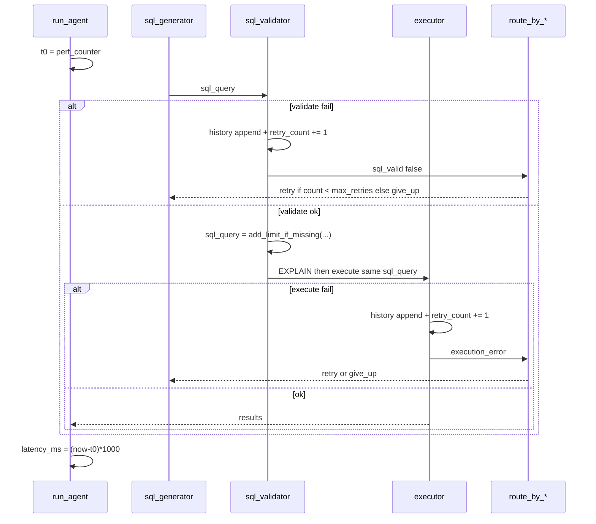

# Design: Fix Agent Retry and Safety

## Technical Approach

Surgical node + edge fix (proposal approach 1). Keep `build_graph` topology. Validator and executor write `retry_history` and bump `retry_count` on failure; routers use `settings.max_retries`; validator persists LIMIT-capped `sql_query` and executor re-applies `add_limit_if_missing` before run; `run_agent` times `invoke`; introspector VS fallback is `show_describe`. Maps to specs `agent-retry-loop`, `sql-execution-limit`, `agent-run-latency`, `schema-source-typing`. Apply with `strict_tdd: true`. No new coordinator; do not attach unused `should_continue_after_retry`.

## Architecture Decisions

| Decision | Options | Tradeoff | Choice |
|----------|---------|----------|--------|
| Loop policy location | Coordinator node vs node+edge writes | Extra node vs small diffs in existing returns | **Nodes write; edges route** |
| History shape | New TypedDict vs existing `list[dict]` | Type safety vs match `sql_generator._format_retry_history` | **Keep `{attempt, sql, error}`** |
| `attempt` value | Pre-increment vs post-increment | Off-by-one | **Post-increment `retry_count`** (1 after first fail) |
| Give-up bound | Hardcoded 3 vs `settings.max_retries` | Tests already pass unused `max_retries` on state | **`retry_count >= settings.max_retries`** |
| LIMIT persist | Validator only vs validator + executor | Single write vs defense in depth | **Both**: persist on validate success; executor caps again with `settings.max_result_rows` |
| LIMIT source | Literal `1000` vs settings | Drift from `max_result_rows` | **`settings.max_result_rows`** |
| Latency | Graph node vs `run_agent` wrap | Memory still 0 unless state patched | **`time.perf_counter` around `graph.invoke`**; set return `latency_ms` only (spec is `run_agent` result) |
| VS fallback | Free-form string vs closed Literal | Breaks API Literal | **`"show_describe"`**; do not store exception in `schema_source` |
| Dead edge helper | Delete vs leave | Scope | **Leave unused**; do not wire it |

## Data Flow

Skip path in `executor_node` (`sql_valid` false) MUST NOT increment or append (validator already did). Success MUST NOT append history.

## File Changes

| File | Action | Description |
|------|--------|-------------|
| `app/agent/nodes/sql_validator.py` | Modify | Fail: copy `retry_history`, append, `retry_count+1`. Success: persist capped `sql_query`; EXPLAIN that string. `from app.config import settings`. |
| `app/agent/nodes/executor.py` | Modify | Cap SQL then `execute_query`. Fail: append history + increment. Skip: unchanged count/history. |
| `app/agent/edges.py` | Modify | Both routers: `settings.max_retries` not `3`. Leave `should_continue_after_retry`. |
| `app/agent/graph.py` | Modify | Time `invoke`; return `latency_ms` elapsed (success and give-up). |
| `app/agent/state.py` | Modify | `schema_source: Literal["show_describe","cache","vector_search","none"]`. |
| `app/agent/nodes/schema_introspector.py` | Modify | VS except: `source = "show_describe"`. |
| `tests/test_agent.py` | Modify | TDD cases below. |
| `app/config.py` | Unchanged | Use existing fields. |
| `app/models/response.py` | Unchanged | Literal already correct. |

## Interfaces / Contracts

Nodes keep returning partial dicts (LangGraph merge). History entry: `{"attempt": int, "sql": str, "error": str}` with non-empty `error`. Cap: `add_limit_if_missing(sql, max_rows=settings.max_result_rows)`.

## Testing Strategy

RED tests in `tests/test_agent.py` before impl. `pytest tests/test_agent.py -v`. Mock `execute_query` / LLM as today.

| Spec scenario | Test approach |
|---------------|----------------|
| Validation failure records history / increments count | Unit: `sql_validator_node` invalid SQL; assert history keys and `retry_count==1` |
| Execution failure records history / still increments | Unit: `executor_node` with `sql_valid` True; mock raise; assert history + count |
| Success leaves history empty | Unit or graph: happy path; `retry_history==[]` |
| Custom max_retries / at bound give_up / below bound retry | Patch `settings.max_retries`; unit `route_by_*`; graph: invalid generate until give-up after 2 fails |
| Missing / oversize / in-cap LIMIT; EXPLAIN matches execute | Validator persist `sql_query`; patch `execute_query` and assert EXPLAIN arg equals later execute SQL; executor unit asserts capped string |
| Success/failure `latency_ms` > 0 | Patch `build_graph`/`invoke`; assert `run_agent` result |
| `show_describe` valid; VS fallback not exception text | Introspector: mock VS raise; assert `schema_source=="show_describe"`; Literal via `get_type_hints` or assignment contract |

## Migration / Rollout

No migration. Revert listed files. Default `max_retries=3` keeps similar execute-fail depth; validation-fail give-up is new (was recursion).

## Open Questions

- [x] Off-by-one: increment then `>= settings.max_retries` (spec).
- [x] Latency not written into graph state / memory this change.
- [ ] None blocking.
