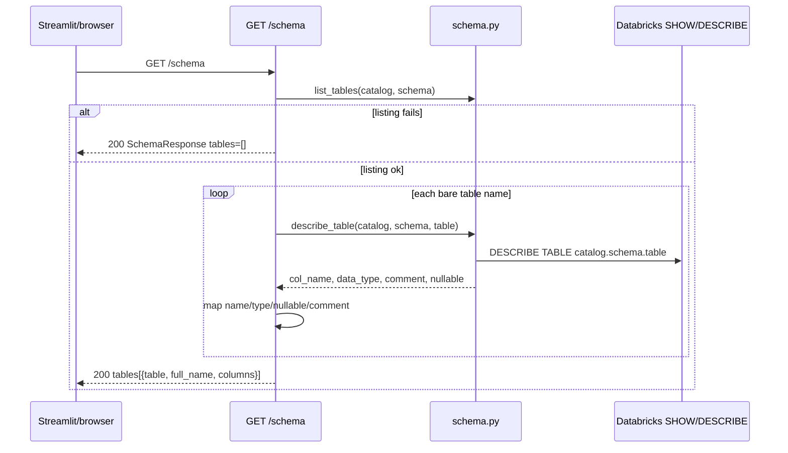

# Design: Fix Schema Surface

## Technical Approach

Keep `app/core/schema.py` Spark-shaped (`list_tables(catalog, schema) -> list[str]`; `describe_table(catalog, schema, table) -> col_name/data_type`). Fix the HTTP adapter in `get_schema` (explore #1), notebook arity/keys, and CORS via `allow_origin_regex` (#4a). Specs: `schema-http-api`, `schema-demo-notebook`, `api-cors-origins`. Do not change core signatures.

## Architecture Decisions

| Decision | Options / tradeoff | Choice |
|----------|--------------------|--------|
| Where to map columns | Core normalize `name`/`type` (touches DDL/LLM) vs HTTP-only mapper vs FQDN overloads | **HTTP mapper in `get_schema` only** — agent/DDL already correct |
| Table identity | Pass `fqdn_target_table` vs catalog+schema settings | **`settings.databricks_catalog` + `databricks_schema`**; `full_name` built as `{catalog}.{schema}.{table}` |
| Dual dialects | Unify keys vs document two layers | **Document**: core Spark keys; HTTP `{name, type, nullable, comment}` |
| Empty listing | 500 vs existing empty 200 | **Keep 200 + `tables=[]`** on `list_tables` failure; log warning |
| CORS | Glob strings (Starlette exact-match, never fire) vs regex vs localhost-only | **`allow_origin_regex=r"https://.*\.(streamlit\.app|hf\.space)"` + exact localhost/127.0.0.1:8501**; keep `allow_credentials=True` |
| Pydantic columns | Typed `SchemaColumn` vs `list[dict]` | **Keep `list[dict]`**; comment is contract (proposal) |
| Streamlit | Change expander keys vs fix API | **UI unchanged** (`t["table"]`, `col.get("name")`/`type`) |
| Notebook | Map to HTTP keys vs core honesty | **Two-/three-arg core; print `col_name`/`data_type`; iterate bare names** |

## Data Flow



Notebook: same core calls, **no** HTTP mapper.

CORS (preflight): Starlette regex + exact `allow_origins` for local Streamlit; not used by server-side `requests` UI.

## File Changes

| File | Action | Description |
|------|--------|-------------|
| `app/main.py` | Modify | Correct arity; map columns; CORS regex |
| `app/models/response.py` | Modify | Comment/contract only unless typed columns added |
| `notebooks/01_demo.ipynb` | Modify | `list_tables(catalog, schema)`; `describe_table("samples","tpch",…)`; Spark print keys; empty list safe |
| `tests/test_api.py` | Modify | Mock `app.core.schema.list_tables`/`describe_table` (lazy import in handler) |
| `app/core/schema.py` | Unchanged | Consume only |
| `ui/streamlit_app.py` | Unchanged | Keys already HTTP-shaped |

## Interfaces / Contracts

HTTP table: `catalog`, `schema`, `table` (bare), `full_name` = `{catalog}.{schema}.{table}`, `columns[]` with `name`, `type`, `nullable`, `comment` (missing comment → `""`).

Core unchanged. Mapper (non-obvious, in `get_schema` only):

```python
{"name": c.get("col_name"), "type": c.get("data_type"),
 "nullable": c.get("nullable", True), "comment": c.get("comment") or ""}
```

CORS: `allow_origins=["http://localhost:8501","http://127.0.0.1:8501"]`, `allow_origin_regex=r"https://.*\.(streamlit\.app|hf\.space)"`.

## Testing Strategy

| Layer | What | Approach |
|-------|------|----------|
| Unit/API | Success mapping + `full_name`; empty 200 on list failure | pytest TestClient; patch core funcs (strict TDD: RED then implement) |
| CORS | Optional: Origin header regex vs glob | Not required by spec; localhost still in `allow_origins` |
| E2E | None | No e2e runner |

## Migration / Rollout

No migration. Revert `main.py`, notebook, `test_api.py`.

## Open Questions

- [ ] `describe_table` exceptions after a successful list: leave uncaught (possible 500) — not in spec
- [ ] CORS regex breadth (`evil.streamlit.app`) accepted for demo
