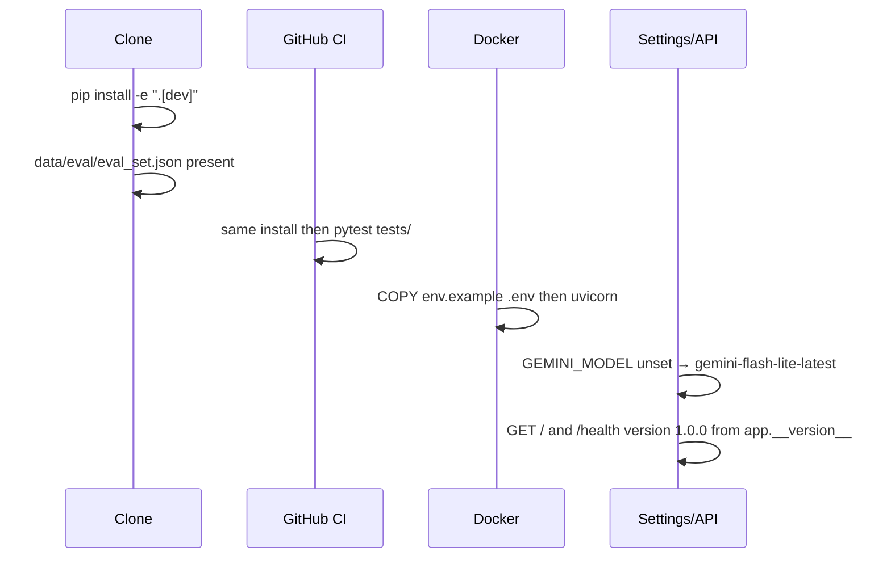

# Design: Harden Packaging

## Technical Approach

Approach 1 (surgical): align clone → test → Docker with tracked files and README. No packaging rewrite, no new extras, no Makefile Windows port. Specs: `ci-editable-install`, `docker-env-example`, `eval-set-shipping`, `gemini-default-model`, `unified-version`, `windows-pytest-docs`.

Today: CI piecemeal pip (no langgraph) vs README `pip install -e ".[dev]"`; Dockerfile `COPY .env.example .env` vs tracked `env.example`; `.gitignore` `data/eval/*.json` hides `eval_set.json`; `gemini_model` default `gemini-2.0-flash-exp` vs template `gemini-flash-lite-latest`; versions `0.9.0` / `0.7.0` / `0.2.0`; README `make docker-build` with no Makefile target; `run_tests.py` `--timeout=15` without `pytest-timeout`.

## Architecture Decisions

| Decision | Options / tradeoff | Choice |
|----------|--------------------|--------|
| CI install | Keep slim list vs `pip install -e ".[dev]"` vs new `[test]` extra | **`pip install -e ".[dev]"`** — matches README; `dev` already exists; langgraph comes from `[project].dependencies`. Heavier CI accepted. Keep dummy env for Settings. |
| Docker env | Invent `.env.example` vs COPY `env.example` | **`COPY env.example .env`**. Keep `requirements.txt` install (existing layer cache). Header: `cp env.example .env`. |
| Eval gitignore | Un-ignore all `data/eval/*.json` vs exception only | **`!data/eval/eval_set.json`**; keep ignore on `eval_results.json` / `eval_gt.json`. Force-add if still ignored. |
| Gemini default | Require `.env` vs Field default | **Field default `gemini-flash-lite-latest`**. Env override unchanged. `env.example` already correct. |
| Version | Four literals vs import `__version__` | **`__version__ = "1.0.0"` in `app/__init__.py`**; FastAPI `version=`, `GET /`, health import it; `pyproject.toml` `1.0.0`. Avoids API drift. |
| `run_tests.py` timeout | Add `pytest-timeout` vs drop flag | **Drop `--timeout=15`**. Wrapper must not lie; extra is out of scope. |
| Docker docs | Drop README `make docker-build` vs add target | **Add `docker-build` to Makefile** + document `docker build -t text-to-sql-agent .` for Windows. Unix Make stays. |

## Data Flow



No LangGraph change.

## File Changes

| File | Action | Description |
|------|--------|-------------|
| `.github/workflows/ci.yml` | Modify | Replace piecemeal pip with `pip install -e ".[dev]"`; keep dummy creds + pytest/cov/codecov |
| `Dockerfile` | Modify | `COPY env.example .env` |
| `env.example` | Modify | Header `cp env.example .env` |
| `.gitignore` | Modify | Negate `data/eval/eval_set.json` |
| `data/eval/eval_set.json` | Modify | Ensure tracked (`git add -f` if needed) |
| `app/config.py` | Modify | Default `gemini_model` |
| `app/__init__.py` | Modify | `__version__ = "1.0.0"` |
| `pyproject.toml` | Modify | `version = "1.0.0"` |
| `app/main.py` | Modify | FastAPI + `GET /` use `__version__` |
| `app/api/health.py` | Modify | Health `version=__version__` |
| `README.md` | Modify | Windows pytest + `run_tests.py`; honest docker build |
| `Makefile` | Modify | `docker-build` target |
| `run_tests.py` | Modify | Drop `--timeout=15` |
| `tests/test_api.py` | Modify | Assert version `1.0.0` on `/` and `/health` |
| `tests/test_config.py` or existing | Create/Modify | Unset `GEMINI_MODEL` → flash-lite-latest (strict TDD) |

## Interfaces / Contracts

```python
# app/__init__.py
__version__ = "1.0.0"

# Settings
gemini_model: str = Field(default="gemini-flash-lite-latest")

# GET / and HealthResponse.version
{"version": __version__}  # "1.0.0"
```

CI install (non-obvious vs current workflow):

```yaml
pip install -e ".[dev]"
```

.gitignore exception:

```
data/eval/*.json
!data/eval/eval_set.json
```

## Testing Strategy

| Layer | What | Approach |
|-------|------|----------|
| Unit/API | `/` and `/health` version `1.0.0`; default model without `GEMINI_MODEL` | pytest TestClient; monkeypatch delete env; **RED then implement** (`strict_tdd: true`) |
| Import | `tests/test_agent.py` can import langgraph after `[dev]` | Existing collection; CI install change |
| Docs/Docker/gitignore | COPY path, Makefile target, tracked eval set | Review + `git check-ignore`; not pytest |
| E2E | None | No e2e runner |

## Migration / Rollout

No data migration. Revert the branch to restore old CI, COPY, gitignore, defaults, versions, README.

## Open Questions

- [x] `[test]` extra — rejected (out of scope)
- [x] `pytest-timeout` — rejected; drop flag
- [ ] CI pin fail on langgraph 0.2 / Py 3.11 — fix pins only if install fails
